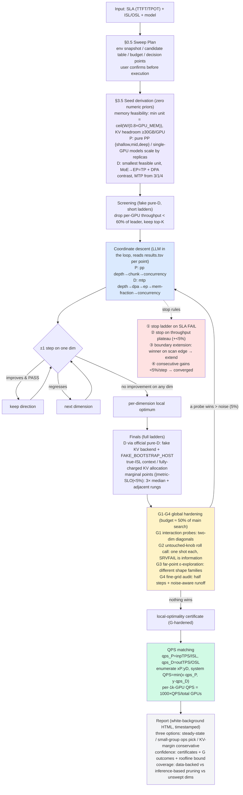
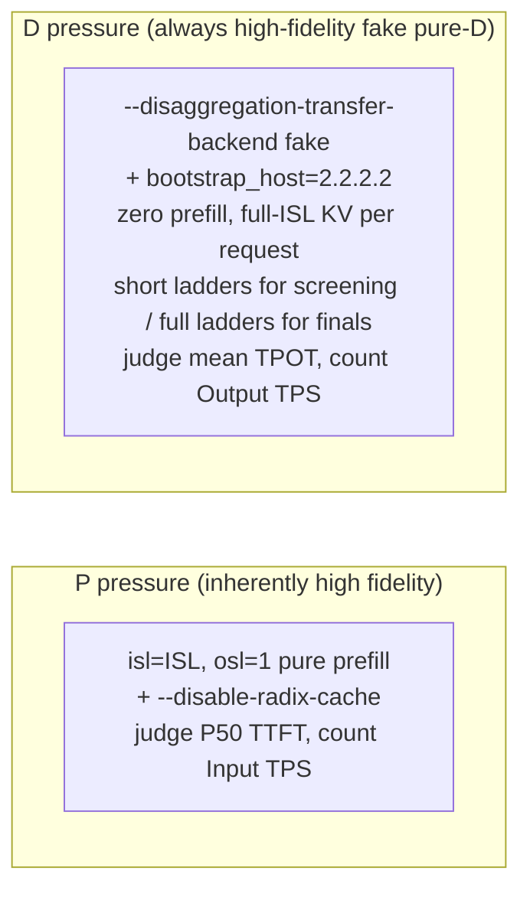

# Optimization-path diagram

Given any SLA + workload + model, the skill's full search pipeline (SKILL.md is the
authoritative definition; this is the guided tour):

## Measurement design at a glance

Validated across two regimes: the multi-GPU split regime (large MoE, PP/EP shape
family) and the single-GPU replica regime (small MoE, TP1/PP1 family) converge to the
correct shape family under the same rules; the G stage has caught a real knob
improvement that coordinate descent missed.
