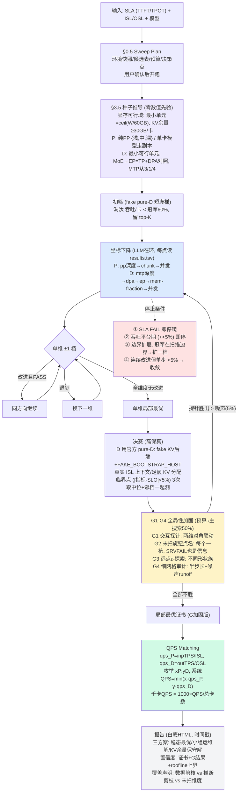
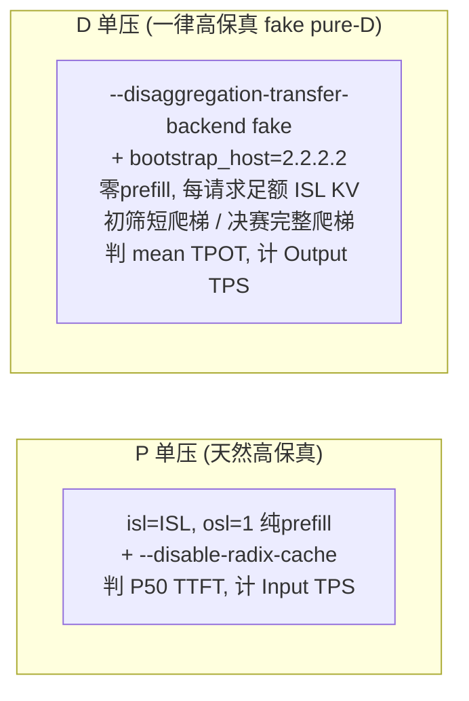

# pro5k-sgl-sweep 优化路径示意图

给定任意 SLA + 负载 + 模型，skill 的完整寻优 pipeline（SKILL.md 是权威定义，本图为导览）：

## 测量方法速览

两轮实测验证：多卡切分 regime（大 MoE，PP/EP 形状族）与单卡副本 regime（小 MoE，TP1/PP1 形状族）均由同一套规则收敛到正确形状族；G 阶段曾抓到坐标下降遗漏的旋钮改进。
