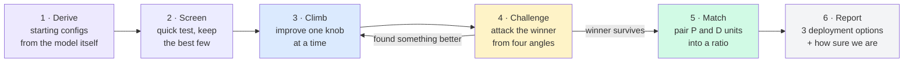

# How the sweep works

One picture, six steps. Details for each step follow below.

---

## Step 1 · Derive starting configs (no tuning history needed)

We never start from a fixed list or past results. Three facts about the model decide
the starting points:

- **How big are the weights?** Divide by usable GPU memory → the smallest number of
  GPUs one serving unit needs. If the model fits on one GPU, the whole game changes:
  scale by running more copies, not by splitting the model.
- **How much memory is left after the weights?** That leftover holds the KV cache and
  bounds decode concurrency. Shapes with too little headroom will saturate — pruned
  before ever running.
- **What structure does it have?** MoE → expert parallelism and data-parallel attention
  are worth trying; a draft head → speculative decoding from the known-good depth 3/1/4.

Plus one hardware law for this PCIe-only box (no NVLink): tensor parallelism pays an
all-reduce on every layer over the slowest link, so prefill prefers pipeline
parallelism and decode prefers low TP. That's enough to write down 2-4 candidate
shapes per side. Prefill and decode are seeded separately because their optima are
always different.

## Step 2 · Screen (cheap elimination)

Run each seed briefly — just 1-2 concurrency levels — and drop anything below 60% of
the leader's per-GPU throughput. No point polishing a shape that loses by 2×.

Two measurement tricks make these numbers trustworthy (used in every later step too):

- **Prefill in isolation**: request 1 output token, so the run is 100% prefill. The
  radix cache must be off, or identical-length test prompts hit the prefix cache and
  TTFT reads fantastically low.
- **Decode in isolation**: SGLang's *fake KV* mode. The server believes the prefill
  already happened elsewhere: it allocates the full 10k-token KV per request (contents
  are garbage — performance-identical) and just decodes. No prefill compute pollutes
  the numbers, memory pressure is real, so the concurrency ceiling is real. Short-input
  shortcuts (e.g. isl=128) are banned — they make attention read a sliver of KV and
  overestimate capacity.

## Step 3 · Climb (one knob at a time)

Take the screening winner and improve it dimension by dimension, most influential knob
first — for prefill: pipeline depth, then chunk size, then concurrency; for decode:
speculative depth, then attention-DP, then expert-parallel, then memory fraction, then
concurrency.

Move one step along a knob. Better and still within SLA? Keep going that way. Worse?
Switch to the next knob. A full pass with no improvement means we've reached a local
optimum. Four stop rules keep this fast:

1. **SLA fail stops a ladder** — latency only gets worse with more load.
2. **Throughput plateau stops a ladder** — if throughput gains <5% while latency still
   "passes", the instance is saturated and extra load is just queueing.
3. **Winner on an edge → extend** — if the best point is the last one we tried, the
   true best may be beyond it; push one more step until the winner has neighbors on
   both sides.
4. **Diminishing returns → converge** — consecutive gains under 5% per step aren't
   worth more probes.

Borderline results (within 5% of the SLA line, or two candidates within 5% of each
other) are re-measured 3× and judged on the median — single runs carry ±3-5% noise.

## Step 4 · Challenge (why we trust the winner)

Climbing one knob at a time can miss better points. Before accepting the winner, spend
about half the search budget attacking it from the four places a better config could
hide:

- **Interactions** — move two knobs *together* (diagonals a one-knob climb never
  visits), e.g. bigger chunk *and* higher concurrency at once.
- **Untouched knobs** — every flag the winner never moved gets one probe (speculative
  top-k, attention backend, memory fraction, all-to-all backend…). A crash is also an
  answer: it closes that dimension.
- **Far points** — test 1-2 completely different shapes (different GPU count, different
  parallel family), guarding against the starting family being wrong altogether.
- **Fine grid** — half-steps around the winner to confirm it isn't the edge of a narrow
  peak.

If any challenger wins by more than noise (5%), it becomes the new start and we climb
again. If nothing wins, the result is certified: *best known, checked against
interactions, unswept knobs, other families, and narrow peaks*. (In practice this
stage has flipped a real knob — a larger KV pool — that pure climbing missed.)
Global optimality still can't be *proven*; the report says exactly what was and wasn't
covered, and a roofline estimate bounds how much could remain.

## Step 5 · Match (turn two winners into one deployment)

Every request flows through one prefill unit (eats ISL tokens) and one decode unit
(emits OSL tokens), so:

- a P unit sustains `inputTPS ÷ ISL` requests/s,
- a D unit sustains `outputTPS ÷ OSL` requests/s,
- a group of x P-units + y D-units sustains the **smaller** of the two sides —
  imbalance is pure waste.

Enumerate small integer ratios and pick the one maximizing QPS per 1000 GPUs. The two
sides' individual champions don't automatically compose best — integer ratios lose
throughput when the sides don't divide evenly, so the top few candidates from each
side all enter the enumeration.

## Step 6 · Report (three answers, not one)

- **Steady-state optimum** — the headline number.
- **Ops-friendly pick** — the smallest well-matched group; recommended when it's within
  ~5% of optimal, because 5-GPU groups beat 46-GPU groups operationally.
- **Conservative pick** — real PD deployments add tens of milliseconds of KV-transfer
  latency on top of measured TTFT; a prefill config that barely passes in the lab will
  violate the SLA in production, so this option swaps in a P config with headroom.

Plus a confidence section (per-knob evidence, challenge outcomes, roofline bound) and a
coverage statement that separates *measured* exclusions from *inferred* ones — the
honest list of where a better config could still hide.

---

Validated across two regimes: a large MoE that must be split across GPUs (pipeline/
expert parallel family) and a small MoE that fits one GPU (replica family) both
converge to the correct shape family under the same rules, with zero carried-over
numbers.
