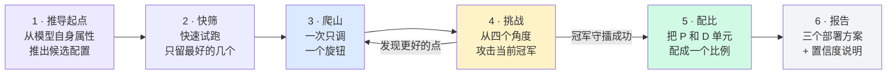

# Sweep 是怎么工作的

一张图，六个步骤；每一步的细节在图下面详解。

---

## Step 1 · 推导起点（不依赖任何调优历史）

从不套用固定清单或历史结论。三个关于模型自身的事实决定起点：

- **权重多大？** 除以单卡可用显存 → 一个服务单元最少要几张卡。如果单卡就放得下，
  整个玩法都会变：靠多跑副本扩展，而不是把模型切开。
- **装完权重还剩多少显存？** 剩余部分装 KV cache，直接决定 decode 能扛多大并发。
  余量太小的形状必然饱和——还没开跑就剪掉。
- **什么结构？** MoE → 专家并行和注意力数据并行值得一试；带草稿头 → 投机解码从
  已知靠谱的深度 3/1/4 起扫。

再加一条本机（纯 PCIe、无 NVLink）的硬件定律：张量并行每层都要在最慢的链路上做一次
all-reduce，所以 prefill 偏好流水线并行、decode 偏好小 TP。有这些就足够写出每侧
2-4 个候选形状。Prefill 和 decode 分开推种子——两者的最优解永远不同。

## Step 2 · 快筛（便宜地淘汰）

每个种子只跑 1-2 个并发档，单卡吞吐低于头名 60% 的直接淘汰——输 2 倍的形状不值得精调。

有两个测量技巧保证这些数字可信（后面每一步也都在用）：

- **单独测 prefill**：只要 1 个输出 token，整条请求就是纯 prefill。必须关掉 radix
  cache，否则等长的测试 prompt 会命中前缀缓存，TTFT 低得离谱是假象。
- **单独测 decode**：用 SGLang 的 *fake KV* 模式。server 以为 prefill 已经在别处
  完成：每个请求按完整 1 万 token 分配 KV（内容是垃圾——性能上无差别），直接开始
  decode。没有 prefill 计算污染数字，显存压力是真实的，所以并发上限也是真实的。
  短输入的偷懒代理（比如 isl=128）被明令禁止——attention 每步只读一小截 KV，会
  严重高估容量。

## Step 3 · 爬山（一次只调一个旋钮）

拿快筛冠军逐个维度改进，影响最大的旋钮排前面——prefill：流水线深度 → chunk 大小
→ 并发；decode：投机深度 → 注意力数据并行 → 专家并行 → 显存比例 → 并发。

沿一个旋钮走一步。变好且不超 SLA？继续同方向。变差？换下一个旋钮。整轮都没有改进，
就到了局部最优。四条停止规则保证速度：

1. **超 SLA 即停梯**——负载越大延迟只会更差。
2. **吞吐平台期即停梯**——延迟还"达标"但吞吐增幅 <5%，说明实例已饱和，多余负载
   全在排队。
3. **冠军在边上 → 外扩**——最好的点如果是最后试的那个，真正的最优可能在更外面；
   再推一步，直到冠军两侧都有邻居。
4. **收益递减 → 收敛**——连续每步增益不到 5%，不值得继续探。

贴线结果（距 SLA 线 5% 以内，或两个候选相差 5% 以内）复测 3 次取中位数——单次测量
有 ±3-5% 的噪声。

## Step 4 · 挑战（凭什么信这个冠军）

一次调一个旋钮的爬山可能漏掉更好的点。在接受冠军之前，花约一半的搜索预算，从
"更优解可能藏身"的四个地方发起攻击：

- **维度交互**——两个旋钮*一起*动（单旋钮爬山永远走不到的对角线），比如同时加大
  chunk 和并发。
- **没动过的旋钮**——冠军从没碰过的 flag 每个都试一枪（投机 top-k、attention
  backend、显存比例、all-to-all backend……）。崩溃也是答案：那个维度就此封死。
- **远点**——测 1-2 个结构完全不同的形状（不同卡数、不同并行家族），防止起点
  一开始就锁死在错误的家族里。
- **细网格**——在冠军周围加密半步，确认它不是窄峰的边缘。

任何挑战者赢过噪声线（5%），它就成为新起点、回到爬山。全都没赢，结果就拿到证书：
*已知最优，且经过交互、未扫旋钮、其他家族、窄峰四项检验*。（实践中这一步真的翻过
一次盘——加大 KV 池这个旋钮就是纯爬山漏掉的。）全局最优依然*无法证明*；报告会写清
哪些查过、哪些没查，并用 roofline 估算剩余空间的上限。

## Step 5 · 配比（把两个冠军组成一套部署）

每条请求都要经过一个 prefill 单元（吃进 ISL 个 token）和一个 decode 单元（吐出
OSL 个 token），所以：

- 一个 P 单元的产能 = `inputTPS ÷ ISL` 请求/秒，
- 一个 D 单元的产能 = `outputTPS ÷ OSL` 请求/秒，
- x 个 P + y 个 D 的组，产能取两侧的**较小值**——不平衡的部分纯属浪费。

枚举小整数配比，取"每 1000 卡 QPS"最大的那个。两侧各自的冠军不一定组合出最优——
整数配比在两侧除不尽时会损失吞吐，所以两侧的前几名都要进入枚举。

## Step 6 · 报告（给三个答案，不是一个）

- **稳态最优**——头条数字。
- **运维友好解**——配平的最小组；与最优差距在 ~5% 以内时优先推荐，因为 5 卡一组
  在运维上完胜 46 卡一组。
- **保守解**——真实 PD 部署会在实测 TTFT 之上叠加几十毫秒的 KV 传输延迟；实验室里
  贴线通过的 prefill 配置到了生产必超 SLA，所以这个方案换用留足余量的 P 配置。

另附置信度一节（逐旋钮证据、挑战结果、roofline 上界）和覆盖声明——把*实测排除*和
*推断排除*分开列，诚实交代更优解还可能藏在哪。

---

已在两种 regime 验证：必须切开跑的大 MoE（流水线/专家并行家族）和单卡放得下的小
MoE（副本家族），同一套规则、零历史数字，都收敛到了正确的形状家族。
